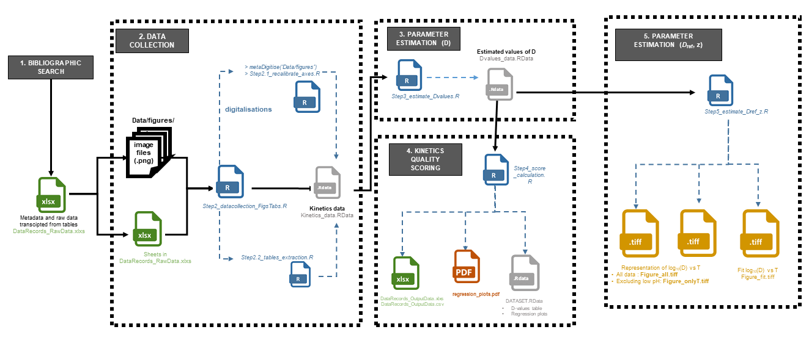

# pox_inactivation: Data and model for describing Poxviridae thermal inactivation

The aim of this repository is to present a database of Poxviridae inactivation kinetics on surfaces and in suspensions.

The codes provided makes it possible to reproduce the approach and figures of the article submitted to Microbial risk analysis.

## Citation

L Guillier, E Chaix. Data and model for describing Poxviridae thermal inactivation. https://github.com/lguillier/pox_inactination
