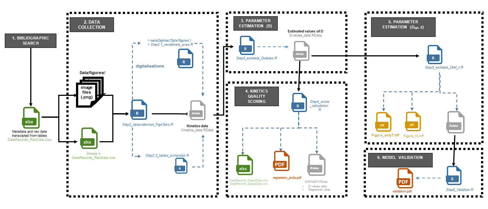

# pox_inactivation: Data and model for describing Poxviridae thermal inactivation

The aim of this repository is to present a database of Poxviridae inactivation kinetics on surfaces and in suspensions.

The codes provided makes it possible to reproduce the approach and figures of the article submitted to Microbial risk analysis.

## Metadata
Version : 1

Original Release Date : 18 August 2022

## Citation
Guillier, L., Chaix, E. 2022. Data and model for describing Poxviridae thermal inactivation, v 1. https://github.com/lguillier/pox_inactivation.
